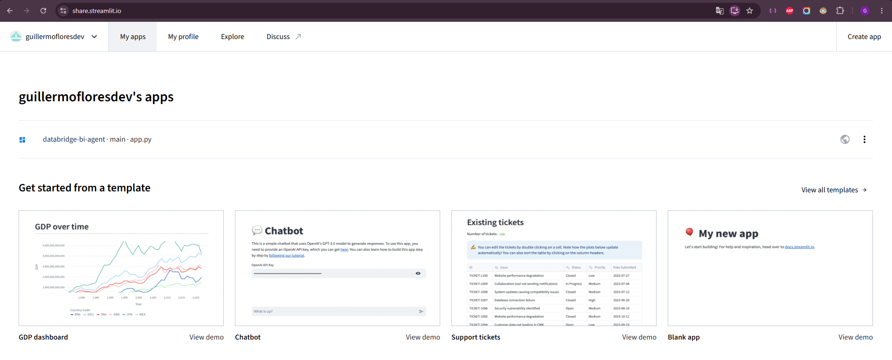
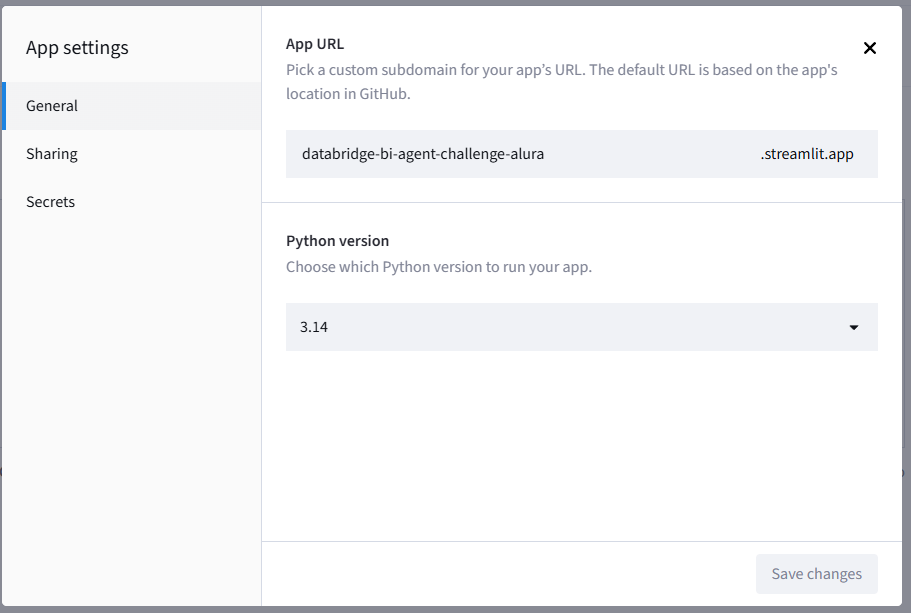
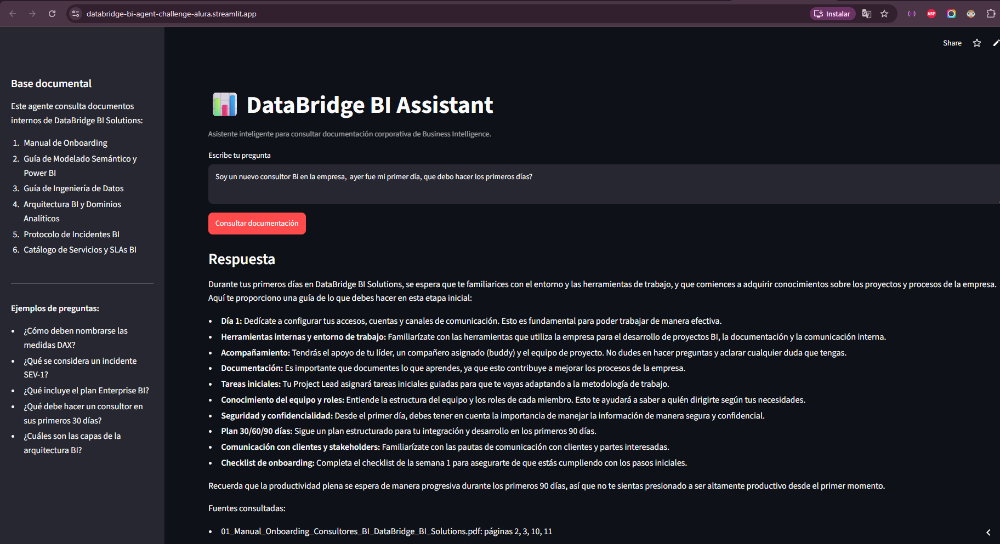
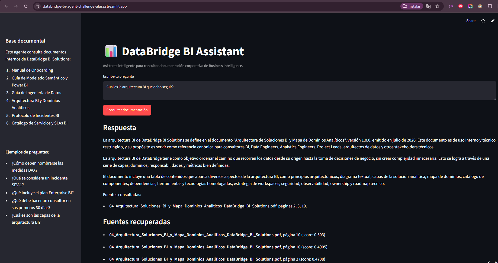
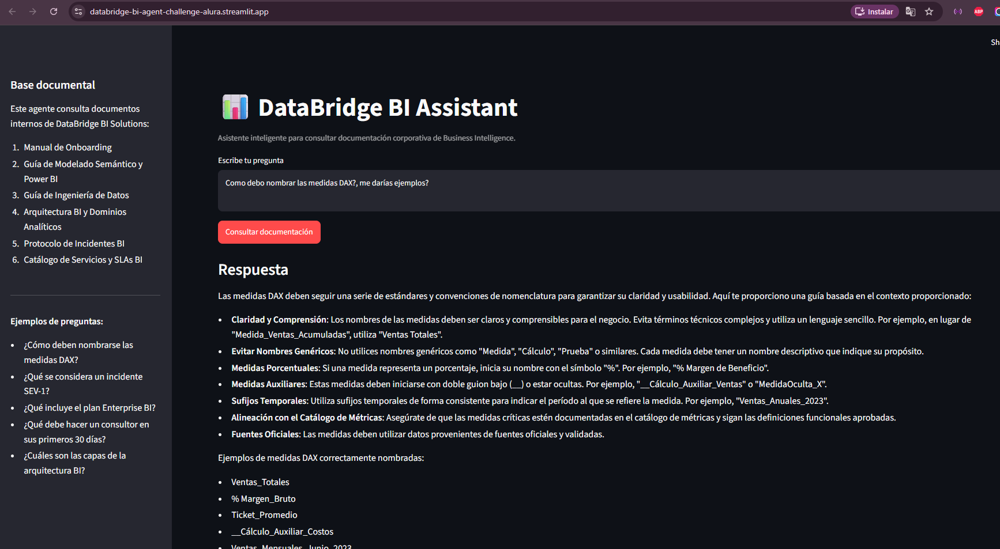
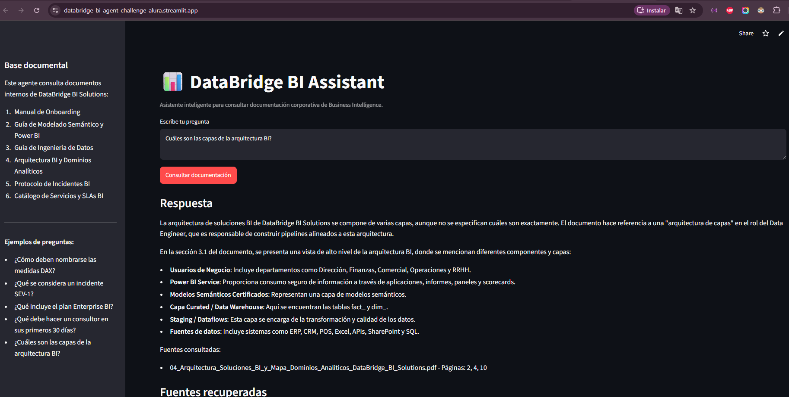
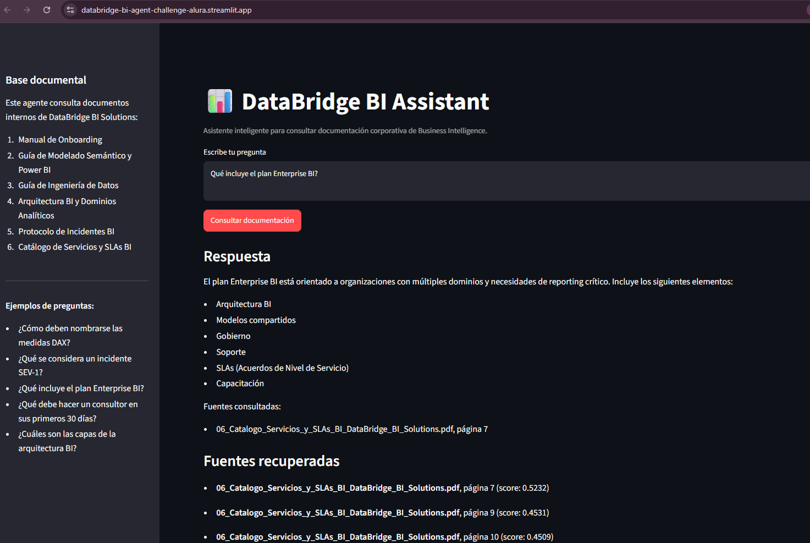

# DataBridge BI Assistant

DataBridge BI Assistant es un agente inteligente desarrollado para consultar documentación corporativa de una empresa ficticia de Business Intelligence llamada *DataBridge BI Solutions*.

El proyecto fue desarrollado como parte del *Challenge Alura*. Su objetivo principal es demostrar cómo un agente de inteligencia artificial puede responder preguntas en lenguaje natural utilizando documentos PDF como fuente de conocimiento.

La solución implementa una arquitectura *RAG* (Retrieval-Augmented Generation), utilizando documentos internos en PDF, embeddings semánticos, búsqueda vectorial local y generación de respuestas con Cohere.

---

## Tabla de contenidos

## 📑 Índice

- [Descripción General del Proyecto](#descripción-general-del-proyecto)
- [Problema que Resuelve](#problema-que-resuelve)
- [Base Documental Utilizada](#base-documental-utilizada)
- [Arquitectura de la Solución Implementada](#arquitectura-de-la-solución-implementada)
- [Tecnologías y Herramientas Utilizadas](#tecnologías-y-herramientas-utilizadas)
- [Estructura del Proyecto](#estructura-del-proyecto)
- [Instrucciones para Ejecutar el Proyecto](#instrucciones-para-ejecutar-el-proyecto)
  - [Construcción del Índice Documental](#construcción-del-índice-documental)
  - [Ejecución de la Aplicación](#ejecución-de-la-aplicación)
- [Ejemplos de Preguntas que el Agente Puede Responder](#ejemplos-de-preguntas-que-el-agente-puede-responder)
- [Ejemplos de Respuestas Generadas por el Agente](#ejemplos-de-respuestas-generadas-por-el-agente)
- [Control de Consultas No Documentales](#control-de-consultas-no-documentales)
- [Deploy de la Aplicación](#deploy-de-la-aplicación)
  - [Configuración de Secretos en Streamlit Community Cloud](#configuración-de-secretos-en-streamlit-community-cloud)
  - [Evidencia del Deploy](#evidencia-del-deploy)
  - [Evidencia de las Preguntas](#evidencia-de-las-preguntas)
- [Comandos Útiles](#comandos-útiles)
- [Consideraciones de Seguridad](#consideraciones-de-seguridad)
- [Estado Actual del Proyecto](#estado-actual-del-proyecto)
- [Autor](#autor)
- [Licencia](#licencia)


---

## Descripción general del proyecto

*DataBridge BI Assistant* es una aplicación web construida con Streamlit que permite consultar una base documental en PDF mediante preguntas en lenguaje natural.

El agente responde utilizando documentación interna de una empresa ficticia llamada *DataBridge BI Solutions*, dedicada a servicios de Business Intelligence, ingeniería de datos, Power BI, modelado semántico, gobierno de datos y soporte analítico.

El usuario puede hacer preguntas sobre temas como:

- Estándares de medidas DAX.
- Modelado semántico en Power BI.
- Ingeniería de datos.
- Calidad de datos.
- Arquitectura de soluciones BI.
- Incidentes de datos y reportes.
- Onboarding de consultores BI.
- Servicios, planes y SLAs de BI.

El agente recupera fragmentos relevantes de la documentación y genera una respuesta basada en la información encontrada.

---

## Problema que resuelve

En muchas organizaciones, la documentación técnica, operativa y comercial se encuentra distribuida en múltiples archivos PDF, manuales, guías y protocolos.

Esto genera problemas como:

- Dificultad para encontrar información rápidamente.
- Dependencia de personas específicas para responder dudas.
- Riesgo de respuestas inconsistentes.
- Baja adopción de estándares internos.
- Pérdida de tiempo buscando en documentos extensos.
- Dificultad para nuevos colaboradores durante el onboarding.

Este proyecto soluciona ese problema mediante un agente RAG que puede:

1. Leer documentos PDF.
2. Extraer y procesar o.
3. Dividir el contenido en fragmentos.
4. Generar embeddings semánticos.
5. Recuperar los fragmentos más relevantes ante una pregunta.
6. Generar una respuesta clara y conualizada.
7. Mostrar las fuentes utilizadas para responder.

---

## Base documental utilizada

La base de conocimiento está formada por 6 documentos PDF generados para la empresa ficticia *DataBridge BI Solutions*.


docs/
├── 01_Manual_Onboarding_Consultores_BI_DataBridge_BI_Solutions.pdf
├── 02_Guia_Oficial_Modelado_Semantico_y_PowerBI_DataBridge_BI_Solutions.pdf
├── 03_Guia_Oficial_Ingenieria_de_Datos_DataBridge_BI_Solutions.pdf
├── 04_Arquitectura_Soluciones_BI_y_Mapa_Dominios_Analiticos_DataBridge_BI_Solutions.pdf
├── 05_Protocolo_Incidentes_Datos_y_Reportes_BI_DataBridge_BI_Solutions.pdf
└── 06_Catalogo_Servicios_y_SLAs_BI_DataBridge_BI_Solutions.pdf


### Descripción de documentos

| Documento | Propósito |
|---|---|
| Manual de Onboarding para Nuevos Consultores BI | Explica cultura, roles, herramientas, plan 30/60/90 días y primeros pasos para nuevos consultores. |
| Guía Oficial de Modelado Semántico y Power BI | Define estándares de modelos semánticos, medidas DAX, nomenclatura, performance, seguridad RLS y publicación. |
| Guía Oficial de Ingeniería de Datos | Define estándares de ingesta, transformación, calidad, linaje, nomenclatura y pipelines de datos. |
| Arquitectura de Soluciones BI y Mapa de Dominios Analíticos | Describe capas de arquitectura, dominios analíticos, componentes BI, ownership y workspaces. |
| Protocolo de Incidentes de Datos y Reportes BI | Define severidades, roles, proceso de respuesta, mitigación, cierre y post-mortems de incidentes BI. |
| Catálogo de Servicios y SLAs BI | Define servicios ofrecidos, planes comerciales, entregables, SLAs y responsabilidades cliente-consultora. |

---

## Arquitectura de la solución implementada

La solución utiliza una arquitectura RAG simple y liviana, diseñada para funcionar localmente y también en alternativas gratuitas de despliegue como Streamlit Community Cloud.


Usuario
   ↓
Interfaz web Streamlit
   ↓
Pregunta en lenguaje natural
   ↓
Embedding de la pregunta con Cohere
   ↓
Búsqueda semántica local con NumPy
   ↓
Recuperación de chunks relevantes
   ↓
Prompt con cono documental
   ↓
Cohere Chat
   ↓
Respuesta generada
   ↓
Respuesta + fuentes consultadas


### Flujo de procesamiento documental

El proyecto incluye el script build_index.py, encargado de preparar la base documental.


PDFs en docs/
   ↓
Extracción de o con PyPDF
   ↓
División del o en chunks
   ↓
Generación de embeddings con Cohere
   ↓
Almacenamiento local en storage/


Los archivos generados son:


storage/
├── chunks.json
└── embeddings.npy


Estos archivos permiten que la aplicación consulte los documentos sin tener que recalcular los embeddings en cada ejecución.

---

## Tecnologías y herramientas utilizadas

| Tecnología | Uso |
|---|---|
| Python | Lenguaje principal del proyecto. |
| Streamlit | Interfaz web interactiva para el agente. |
| Cohere API | Generación de embeddings y respuestas del modelo conversacional. |
| PyPDF | Extracción de o desde documentos PDF. |
| NumPy | Cálculo de similitud semántica entre vectores. |
| python-dotenv | Manejo de variables de entorno en ejecución local. |
| Git y GitHub | Control de versiones y publicación del repositorio. |
| Streamlit Community Cloud | Despliegue gratuito de la aplicación. |

---

## Estructura del proyecto


databridge-bi-agent/
│
├── app.py
├── build_index.py
├── requirements.txt
├── .env.example
├── .gitignore
├── README.md
│
├── docs/
│   ├── 01_Manual_Onboarding_Consultores_BI_DataBridge_BI_Solutions.pdf
│   ├── 02_Guia_Oficial_Modelado_Semantico_y_PowerBI_DataBridge_BI_Solutions.pdf
│   ├── 03_Guia_Oficial_Ingenieria_de_Datos_DataBridge_BI_Solutions.pdf
│   ├── 04_Arquitectura_Soluciones_BI_y_Mapa_Dominios_Analiticos_DataBridge_BI_Solutions.pdf
│   ├── 05_Protocolo_Incidentes_Datos_y_Reportes_BI_DataBridge_BI_Solutions.pdf
│   └── 06_Catalogo_Servicios_y_SLAs_BI_DataBridge_BI_Solutions.pdf
│
├── storage/
│   ├── chunks.json
│   └── embeddings.npy
│
└── src/
    ├── __init__.py
    ├── document_loader.py
    ├── _splitter.py
    ├── cohere_client.py
    ├── retriever.py
    ├── rag_chain.py
    ├── query_classifier.py
    └── prompts.py


---

## Instrucciones para ejecutar el proyecto

### 1. Clonar el repositorio

```bash
git clone https://github.com/GuillermoFloresDev/databridge-bi-agent
cd databridge-bi-agent
```

### 2. Crear entorno virtual

En Windows:

```bash
python -m venv .venv
.venv\Scripts\activate
```

En Linux o macOS:

```bash
python3 -m venv .venv
source .venv/bin/activate
```

### 3. Instalar dependencias

```bash
pip install -r requirements.txt
```

### 4. Crear archivo .env

En Linux o macOS:

```bash
cp .env.example .env
```

En Windows PowerShell:

```powershell
Copy-Item .env.example .env
```

### 5. Configurar API Key de Cohere

Editar el archivo .env y agregar la API Key real de Cohere.

```env
COHERE_API_KEY=tu_api_key_real_de_cohere
COHERE_EMBED_MODEL=embed-v4.0
COHERE_CHAT_MODEL=command-r-plus-08-2024
TOP_K=5
MIN_RELEVANCE_SCORE=0.23
```

> Importante: el archivo .env no debe subirse al repositorio.

---

## Construcción del índice documental

Si los archivos de storage/ no existen o deseas regenerarlos, ejecutar:

```bash
python build_index.py
```

Este comando realiza los siguientes pasos:

1. Lee los PDFs ubicados en la carpeta docs/.
2. Extrae el o página por página.
3. Divide el contenido en chunks.
4. Genera embeddings con Cohere.
5. Guarda los chunks y embeddings en la carpeta storage/.

### Ejemplo de salida esperada


Loading PDF documents...
Loaded 77 PDF pages with .
Creating  chunks...
Created 165 chunks.
Creating embeddings with Cohere...
Embedding batch 1 (32/165)
Embedding batch 2 (64/165)
Embedding batch 3 (96/165)
Embedding batch 4 (128/165)
Embedding batch 5 (160/165)
Embedding batch 6 (165/165)
Saving chunks and embeddings...
Index created successfully.
Chunks: storage\chunks.json
Embeddings: storage\embeddings.npy


---

## Ejecución de la aplicación

Para levantar la aplicación en local:

```bash
streamlit run app.py
```

La aplicación se abrirá normalmente en:


http://localhost:8501


---

## Ejemplos de preguntas que el agente puede responder

> En esta sección se incluyen preguntas de prueba que el agente puede responder usando la documentación cargada.

### Pregunta 1


¿Qué debe hacer un consultor en sus primeros 30 días?


### Pregunta 2


¿Cómo deben nombrarse las medidas DAX?


### Pregunta 3


¿Qué se considera un incidente SEV-1?


### Pregunta 4


¿Cuáles son las capas de la arquitectura BI?


### Pregunta 5


¿Cómo deben nombrarse las medidas DAX?


---

## Ejemplos de respuestas generadas por el agente

> En esta sección se encuentran respuestas reales generadas por el agente durante la ejecución de la aplicación desplegada.

### Ejemplo 1

*Pregunta:*


Soy un nuevo consultor Bi en la empresa,  ayer fue mi primer día, que debo hacer los primeros días?


*Respuesta generada por el agente: *


Durante tus primeros días en DataBridge BI Solutions, se espera que te familiarices con el entorno y las herramientas de trabajo, y que comiences a adquirir conocimientos sobre los proyectos y procesos de la empresa. Aquí te proporciono una guía de lo que debes hacer en esta etapa inicial:

Día 1: Dedícate a configurar tus accesos, cuentas y canales de comunicación. Esto es fundamental para poder trabajar de manera efectiva.
Herramientas internas y entorno de trabajo: Familiarízate con las herramientas que utiliza la empresa para el desarrollo de proyectos BI, la documentación y la comunicación interna.
Acompañamiento: Tendrás el apoyo de tu líder, un compañero asignado (buddy) y el equipo de proyecto. No dudes en hacer preguntas y aclarar cualquier duda que tengas.
Documentación: Es importante que documentes lo que aprendes, ya que esto contribuye a mejorar los procesos de la empresa.
Tareas iniciales: Tu Project Lead asignará tareas iniciales guiadas para que te vayas adaptando a la metodología de trabajo.
Conocimiento del equipo y roles: Entiende la estructura del equipo y los roles de cada miembro. Esto te ayudará a saber a quién dirigirte según tus necesidades.
Seguridad y confidencialidad: Desde el primer día, debes tener en cuenta la importancia de manejar la información de manera segura y confidencial.
Plan 30/60/90 días: Sigue un plan estructurado para tu integración y desarrollo en los primeros 90 días.
Comunicación con clientes y stakeholders: Familiarízate con las pautas de comunicación con clientes y partes interesadas.
Checklist de onboarding: Completa el checklist de la semana 1 para asegurarte de que estás cumpliendo con los pasos iniciales.
Recuerda que la productividad plena se espera de manera progresiva durante los primeros 90 días, así que no te sientas presionado a ser altamente productivo desde el primer momento.


*Fuentes consultadas:*


01_Manual_Onboarding_Consultores_BI_DataBridge_BI_Solutions.pdf: páginas 2, 3, 10, 11


*Fuentes recuperadas:*


01_Manual_Onboarding_Consultores_BI_DataBridge_BI_Solutions.pdf, página 10 (score: 0.547)
01_Manual_Onboarding_Consultores_BI_DataBridge_BI_Solutions.pdf, página 3 (score: 0.5409)
01_Manual_Onboarding_Consultores_BI_DataBridge_BI_Solutions.pdf, página 1 (score: 0.5397)
01_Manual_Onboarding_Consultores_BI_DataBridge_BI_Solutions.pdf, página 2 (score: 0.5394)
01_Manual_Onboarding_Consultores_BI_DataBridge_BI_Solutions.pdf, página 11 (score: 0.5004)


---

### Ejemplo 2

*Pregunta:*


Cual es la arquitectura BI que debo seguir?


*Respuesta generada por el agente:*


La arquitectura BI de DataBridge BI Solutions se define en el documento "Arquitectura de Soluciones BI y Mapa de Dominios Analíticos", versión 1.0.0, emitido en julio de 2026. Este documento es de uso interno y técnico restringido, y su propósito es servir como referencia canónica para consultores BI, Data Engineers, Analytics Engineers, Project Leads, arquitectos de datos y otros stakeholders técnicos.

La arquitectura BI de DataBridge tiene como objetivo ordenar el camino que recorren los datos desde su origen hasta la toma de decisiones de negocio, sin crear complejidad innecesaria. Esto se logra a través de una serie de capas, dominios, responsabilidades y métricas bien definidas.

El documento incluye una tabla de contenidos que abarca diversos aspectos de la arquitectura BI, como principios arquitectónicos, diagrama ual, capas de la solución analítica, mapa de dominios, catálogo de componentes, dependencias, herramientas y tecnologías homologadas, estrategia de workspaces, seguridad, observabilidad, ownership y roadmap técnico.


*Fuentes consultadas:*


04_Arquitectura_Soluciones_BI_y_Mapa_Dominios_Analiticos_DataBridge_BI_Solutions.pdf, páginas 2, 3, 10.


*Fuentes recuperadas:*


04_Arquitectura_Soluciones_BI_y_Mapa_Dominios_Analiticos_DataBridge_BI_Solutions.pdf, página 10 (score: 0.503)
04_Arquitectura_Soluciones_BI_y_Mapa_Dominios_Analiticos_DataBridge_BI_Solutions.pdf, página 10 (score: 0.4905)
04_Arquitectura_Soluciones_BI_y_Mapa_Dominios_Analiticos_DataBridge_BI_Solutions.pdf, página 2 (score: 0.4708)
04_Arquitectura_Soluciones_BI_y_Mapa_Dominios_Analiticos_DataBridge_BI_Solutions.pdf, página 1 (score: 0.469)
04_Arquitectura_Soluciones_BI_y_Mapa_Dominios_Analiticos_DataBridge_BI_Solutions.pdf, página 3 (score: 0.4658)


---

### Ejemplo 3

*Pregunta:*


Como debo nombrar las medidas DAX?, me darías ejemplos?


*Respuesta generada por el agente:*


Las medidas DAX deben seguir una serie de estándares y convenciones de nomenclatura para garantizar su claridad y usabilidad. Aquí te proporciono una guía basada en el cono proporcionado:

Claridad y Comprensión: Los nombres de las medidas deben ser claros y comprensibles para el negocio. Evita términos técnicos complejos y utiliza un lenguaje sencillo. Por ejemplo, en lugar de "Medida_Ventas_Acumuladas", utiliza "Ventas Totales".
Evitar Nombres Genéricos: No utilices nombres genéricos como "Medida", "Cálculo", "Prueba" o similares. Cada medida debe tener un nombre descriptivo que indique su propósito.
Medidas Porcentuales: Si una medida representa un porcentaje, inicia su nombre con el símbolo "%". Por ejemplo, "% Margen de Beneficio".
Medidas Auxiliares: Estas medidas deben iniciarse con doble guion bajo (__) o estar ocultas. Por ejemplo, "__Cálculo_Auxiliar_Ventas" o "MedidaOculta_X".
Sufijos Temporales: Utiliza sufijos temporales de forma consistente para indicar el período al que se refiere la medida. Por ejemplo, "Ventas_Anuales_2023".
Alineación con el Catálogo de Métricas: Asegúrate de que las medidas críticas estén documentadas en el catálogo de métricas y sigan las definiciones funcionales aprobadas.
Fuentes Oficiales: Las medidas deben utilizar datos provenientes de fuentes oficiales y validadas.
Ejemplos de medidas DAX correctamente nombradas:

Ventas_Totales
% Margen_Bruto
Ticket_Promedio
__Cálculo_Auxiliar_Costos
Ventas_Mensuales_Junio_2023


*Fuentes consultadas:*


02_Guia_Oficial_Modelado_Semantico_y_PowerBI_DataBridge_BI_Solutions.pdf, página 7, 8.


*Fuentes recuperadas:*


02_Guia_Oficial_Modelado_Semantico_y_PowerBI_DataBridge_BI_Solutions.pdf, página 7 (score: 0.5385)
02_Guia_Oficial_Modelado_Semantico_y_PowerBI_DataBridge_BI_Solutions.pdf, página 7 (score: 0.5219)
03_Guia_Oficial_Ingenieria_de_Datos_DataBridge_BI_Solutions.pdf, página 19 (score: 0.4515)
02_Guia_Oficial_Modelado_Semantico_y_PowerBI_DataBridge_BI_Solutions.pdf, página 5 (score: 0.4245)
01_Manual_Onboarding_Consultores_BI_DataBridge_BI_Solutions.pdf, página 10 (score: 0.4089)


---

### Ejemplo 4

*Pregunta:*


Cuáles son las capas de la arquitectura BI?


*Respuesta generada por el agente:*


La arquitectura de soluciones BI de DataBridge BI Solutions se compone de varias capas, aunque no se especifica el número exacto ni sus nombres en el cono proporcionado. Sin embargo, se puede inferir la existencia de las siguientes capas:

Capa de fuentes de datos: Incluye sistemas como ERP, CRM, POS, Excel, APIs, SharePoint y SQL.
Capa de ingesta de datos: Donde se realiza la ingesta de datos en batch o de manera incremental.
Capa de transformación y calidad: Denominada "Staging / Dataflows", donde se procesan y transforman los datos.
Capa Curated / Data Warehouse: Aquí se encuentran las tablas fact_ y dim_, que almacenan los datos estructurados.
Capa de modelos semánticos: Donde se crean modelos semánticos certificados.
Capa de visualización: Que incluye Power BI Service con sus apps, reports, dashboards y scorecards.


*Fuentes consultadas:*


04_Arquitectura_Soluciones_BI_y_Mapa_Dominios_Analiticos_DataBridge_BI_Solutions.pdf, página 4.


*Fuentes recuperadas:*


04_Arquitectura_Soluciones_BI_y_Mapa_Dominios_Analiticos_DataBridge_BI_Solutions.pdf, página 2 (score: 0.5078)
04_Arquitectura_Soluciones_BI_y_Mapa_Dominios_Analiticos_DataBridge_BI_Solutions.pdf, página 10 (score: 0.5015)
04_Arquitectura_Soluciones_BI_y_Mapa_Dominios_Analiticos_DataBridge_BI_Solutions.pdf, página 10 (score: 0.4861)
04_Arquitectura_Soluciones_BI_y_Mapa_Dominios_Analiticos_DataBridge_BI_Solutions.pdf, página 1 (score: 0.4746)
04_Arquitectura_Soluciones_BI_y_Mapa_Dominios_Analiticos_DataBridge_BI_Solutions.pdf, página 4 (score: 0.4729)


---

### Ejemplo 5

*Pregunta:*


Qué incluye el plan Enterprise BI?


*Respuesta generada por el agente:*


El plan Enterprise BI está orientado a organizaciones con múltiples dominios y necesidades de reporting crítico. Incluye los siguientes elementos:

Arquitectura BI
Modelos compartidos
Gobierno
Soporte
SLAs (Acuerdos de Nivel de Servicio)
Capacitación


*Fuentes consultadas:*


06_Catalogo_Servicios_y_SLAs_BI_DataBridge_BI_Solutions.pdf, página 7


*Fuentes recuperadas:*


06_Catalogo_Servicios_y_SLAs_BI_DataBridge_BI_Solutions.pdf, página 7 (score: 0.5232)
06_Catalogo_Servicios_y_SLAs_BI_DataBridge_BI_Solutions.pdf, página 9 (score: 0.4531)
06_Catalogo_Servicios_y_SLAs_BI_DataBridge_BI_Solutions.pdf, página 10 (score: 0.4509)
04_Arquitectura_Soluciones_BI_y_Mapa_Dominios_Analiticos_DataBridge_BI_Solutions.pdf, página 4 (score: 0.4502)
06_Catalogo_Servicios_y_SLAs_BI_DataBridge_BI_Solutions.pdf, página 4 (score: 0.4393)


---

## Control de consultas no documentales

El agente incluye una capa simple de clasificación de consultas para evitar respuestas irrelevantes.

Por ejemplo, si el usuario escribe:


Hola


El agente responde con un saludo y explica para qué fue construido, sin consultar la documentación.

Respuesta esperada:


¡Hola! Soy DataBridge BI Assistant. Puedo ayudarte a consultar la documentación interna de DataBridge BI Solutions. Puedes preguntarme sobre medidas DAX, incidentes BI, arquitectura analítica, onboarding, ingeniería de datos o servicios y SLAs.


Si la pregunta está fuera del alcance documental o no encuentra suficiente evidencia, el agente responde indicando que no encontró información suficiente en la documentación.

---

## Deploy de la aplicación

La aplicación fue desplegada usando *Streamlit Community Cloud* como alternativa gratuita de despliegue.

El challenge no exige obligatoriamente el despliegue en OCI, por lo que se eligió Streamlit Community Cloud por las siguientes razones:

- Es gratuito.
- Permite desplegar aplicaciones Streamlit directamente desde GitHub.
- No requiere configurar servidores manualmente.
- Permite administrar secretos como la API Key de Cohere sin subirlos al repositorio.
- Entrega una URL pública para compartir la aplicación.

URL pública de la aplicación:


https://databridge-bi-agent-challenge-alura.streamlit.app/


---

## Configuración de secretos en Streamlit Community Cloud

En Streamlit Community Cloud, los secretos deben configurarse desde la sección *Advanced settings* del despliegue.

Ejemplo de configuración:

```toml
COHERE_API_KEY = "tu_api_key_real_de_cohere"
COHERE_EMBED_MODEL = "embed-v4.0"
COHERE_CHAT_MODEL = "command-r-plus-08-2024"
TOP_K = "5"
MIN_RELEVANCE_SCORE = "0.23"
```

No se debe subir el archivo .env al repositorio.

---

## Evidencia del deploy

Captura de pantalla de la aplicación desplegada:




---

## Evidencia de las preguntas

Captura de pantalla de las preguntas respondidas por el agente:







---

## Comandos útiles

### Regenerar índice

```bash
python build_index.py
```

### Ejecutar app local

```bash
streamlit run app.py
```

### Subir cambios a GitHub

```bash
git add .
git commit -m "docs: update README"
git push
```

### Forzar subida de archivos del índice si storage/ está en .gitignore

```bash
git add -f storage/chunks.json storage/embeddings.npy
git commit -m "fix: add generated vector index for deployment"
git push
```

---

## Consideraciones de seguridad

El archivo .env contiene la API Key de Cohere y no debe ser subido al repositorio.

El repositorio debe incluir únicamente .env.example como referencia de configuración.

Ejemplo de .env.example:

```env
COHERE_API_KEY=your_cohere_api_key_here
COHERE_EMBED_MODEL=embed-v4.0
COHERE_CHAT_MODEL=command-r-plus-08-2024
TOP_K=5
MIN_RELEVANCE_SCORE=0.23
```

---

## Estado actual del proyecto


[x] Documentos PDF generados
[x] Lectura de PDFs implementada
[x] División en chunks implementada
[x] Embeddings con Cohere implementados
[x] Búsqueda semántica local con NumPy implementada
[x] Interfaz Streamlit implementada
[x] Filtro para saludos y preguntas vagas implementado
[x] Respuestas con fuentes consultadas implementadas
[x] Ejecución local validada
[x] Deploy final publicado
[x] Capturas de pantalla agregada


---

## Autor

Proyecto desarrollado por:


Guillermo Flores


Repositorio:


https://github.com/GuillermoFloresDev/databridge-bi-agent


---

## Licencia

Este proyecto fue desarrollado con fines educativos como parte del Challenge Alura.